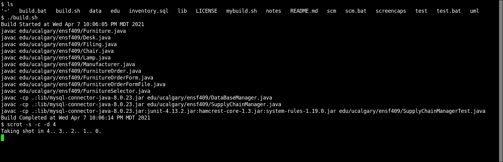
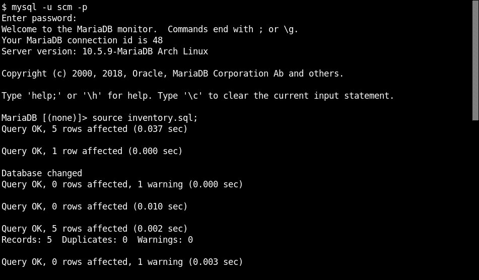
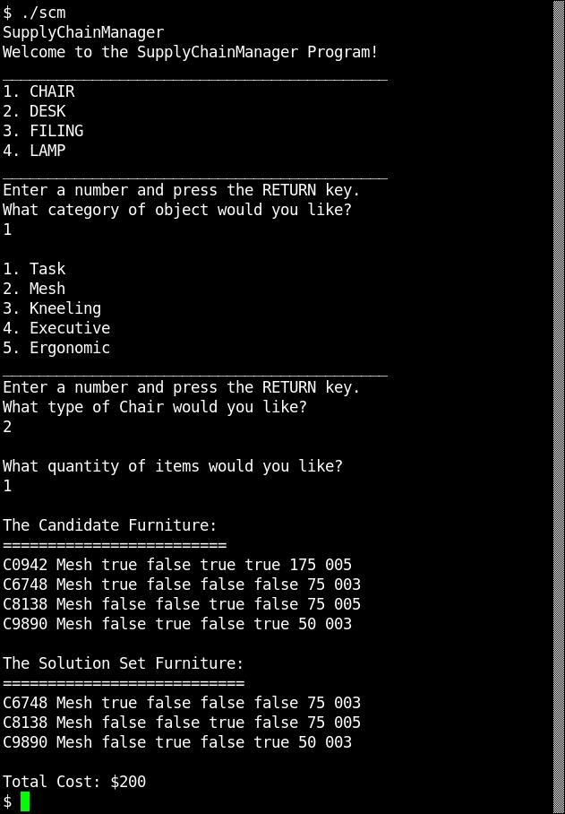
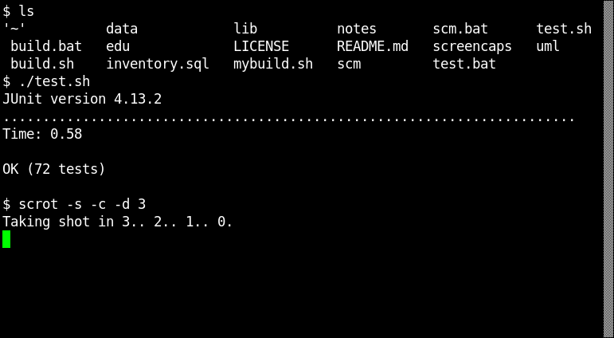
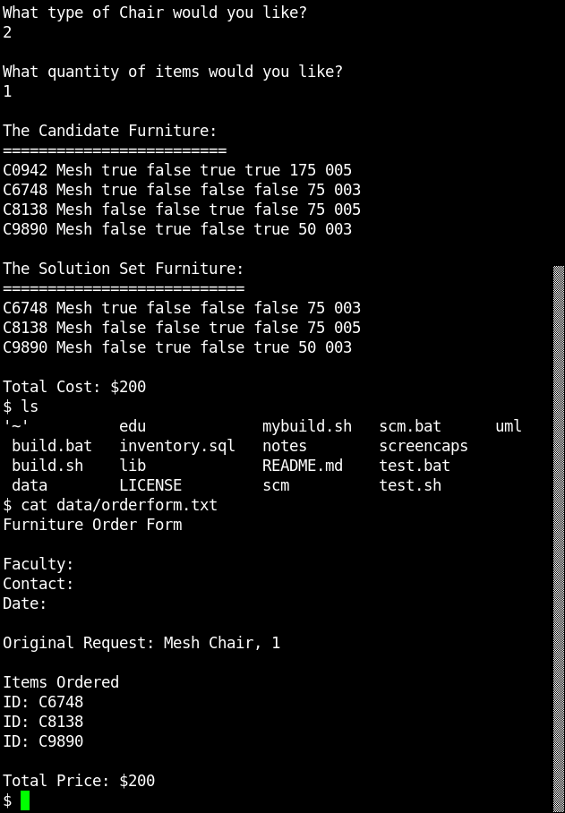

### Team: ENSF409 Group 48
### Team Members: (Ron) Zorondras Rodriguez, Matthew Pelletier 
###               Jade Meggitt, Quinn Ledingham

# Hackathon
Project files for working on the hackathon

This git repo will contain our preliminary UML and some preliminary classes to solve
the INVENTORY Furniture combination of minimum cost problem.

## BUILD INSTRUCTIONS

### Linux or MacOS
`$./build`

### Windows NT
> build

## RUN PROGRAM

* first make sure to load the inventory SQL database

`$ mysql -u username -p
mysql> source inventory.sql;
mysql> quit; `

`java -cp .;lib/mysql-connector-java-8.0.23.jar edu.ucalgary.ensf409.SupplyChainManager`

Or type the following command at the command console (CMD,SH,BASH):

###Linux or MacOS
`$ scm`

### Windows NT
`> scm`

## RUN TEST FILE

### Linux of MacOS
`$ ./test`

### Windows NT

`> test`

### OrderForm Location??

 The orderform output from a scm run is found in the <b>data</b> directory with the filename <a href="data/orderform.txt"><b>orderform.txt</b> </a>

`$ cat data/orderform.txt`

### UML Diagram

 The UML class diagram for the project files is found in the <b>uml</b> directory with the filename <b>ensf409project_v1.3.dia</b> which is in dia format, and a pdf version is found as  <a hfref="uml/ensf409project_v1.3.pdf"><b>ensf409project_v1.3.pdf</b> </a>

/******************************************* END OF FILE ***********************************************************/